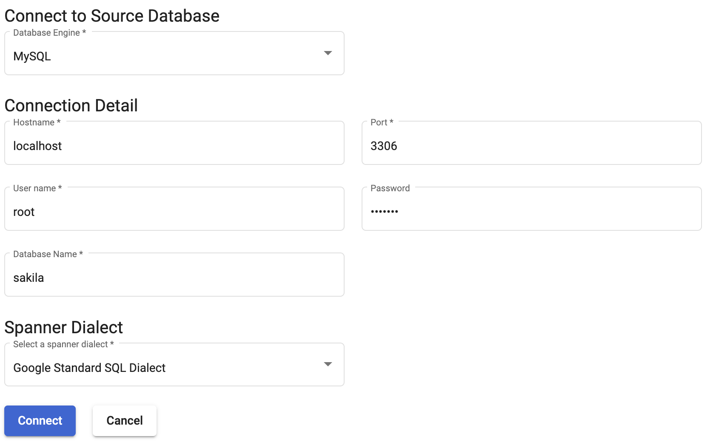
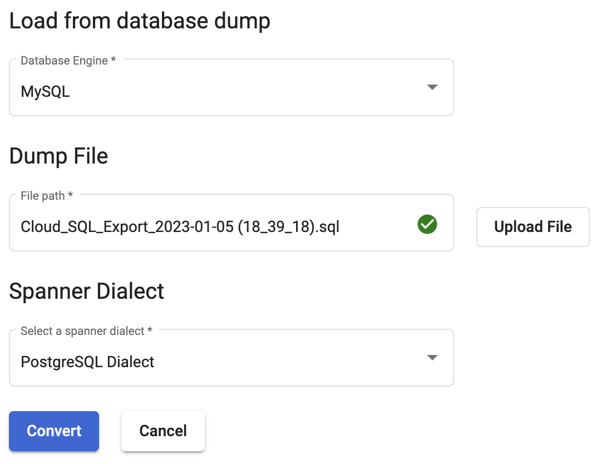
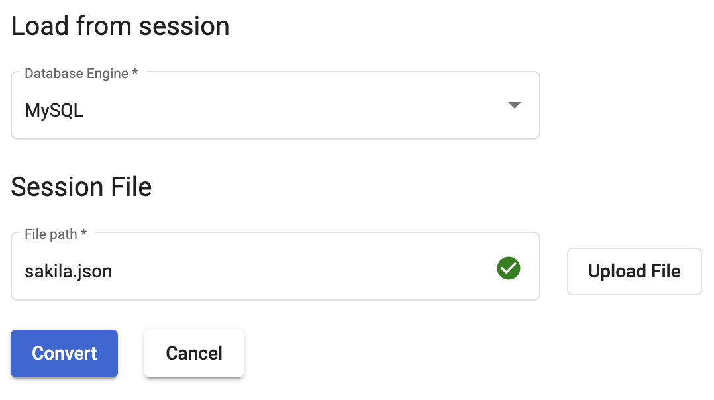

# Connecting to Source database
{: .no_toc }

Spanner migration tool allows users to connect to the source database via three connection mechanisms; 1) directly connect to source database, 2) use a database dump and 3) load a session file.

  

    Table of contents
  

  {: .text-delta }
1. TOC
{:toc}

## Connect to Database

In this connection mechanism the user needs to first select the type of source database engine and then specify the source database connection details like host, port, username , password and database name. Currently, HarbourBridge UI supports the following source databases - MySQL, PostgreSQL, Oracle and SQLServer. User also needs to specify the **spanner** **dialect,** it specifies the query language used. Spanner provides support for two dialects - Google Standard SQL and PostgreSQL.

{: .note }
Users can connect to local, cloud and on-prem instances.

## Load database dump

The user needs to generate a dump of their source database and then provide a path to the generated dump file in the input along with the type of database engine. HarbourBridge supports dump file migration for MySQL and PostgreSQL. User also needs to specify the **spanner** **dialect,** it specifies the query language used. Spanner provides support for two dialects - Google Standard SQL and PostgreSQL. Dump files for MySQL and PostgreSQL can be generated by using [mysqldump](https://dev.mysql.com/doc/refman/8.0/en/mysqldump.html) and [pg_dump](https://www.postgresql.org/docs/current/app-pgdump.html) commands respectively. Please note that the dump file should be present in the same machine on which HarbourBridge is running.

## Load session file

In cases where the user would want to save the schema modifications and come back to them later , for instance in case of complex databases or if multiple users are working on the same database they can do so with the help of [session files](#bookmark=id.4buhr2y7q8jw). Users just need to select the database engine and specify the file path for the saved session file to resume the migration process. Please note that the session file should be present in the same machine on which HarbourBridge is running.

