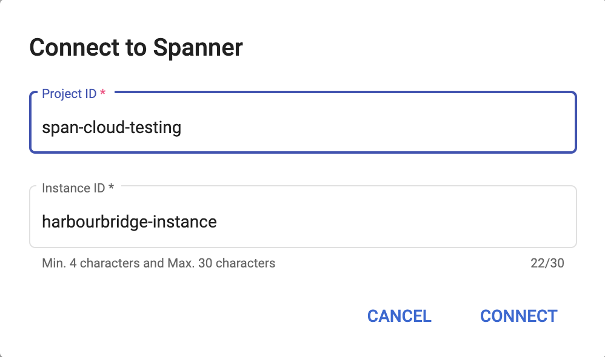

# Connecting to a Spanner Instance
{: .no_toc }

To perform a migration the user needs to connect to a spanner instance where they specify a valid GCP (Google Cloud Platform) project ID and a valid spanner instance. After the successful connection to the spanner instance HarbourBridge validates if the metadata database exists. If not, then a new metadata database is created.

  

    Table of contents
  

  {: .text-delta }
1. TOC
{:toc}

## Top Nav Bar

## Spanner instance configuration

