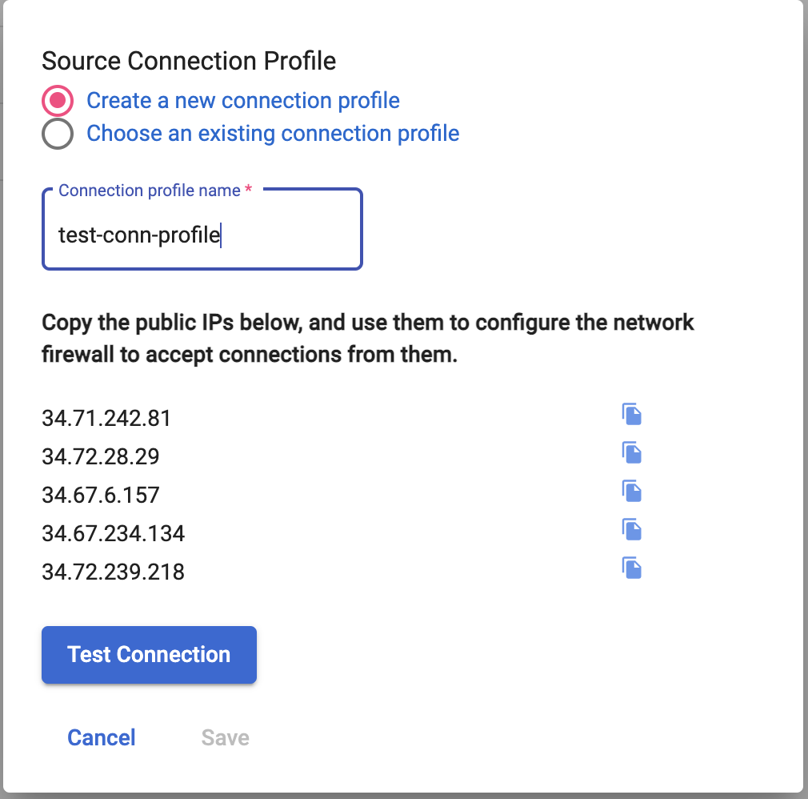
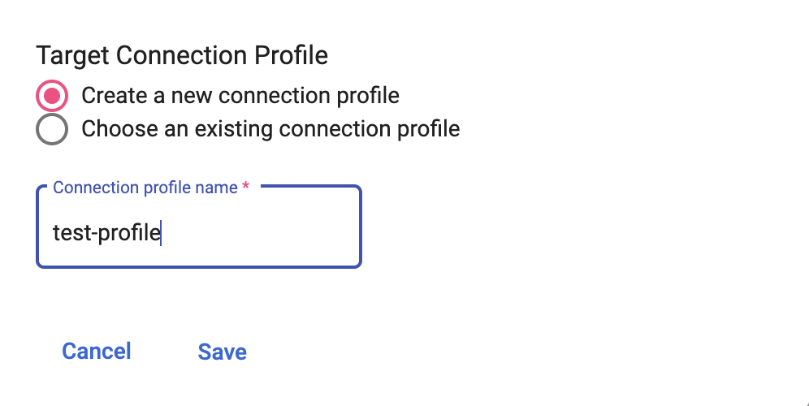

# Setting up connection profiles
{: .no_toc }

In case of minimal downtime migration, HarbourBridge needs information about connection profiles which are required by the datastream. There are two connection profiles that need to be set up - **source connection profile** and **target connection profile.**

  

    Table of contents
  

  {: .text-delta }
1. TOC
{:toc}

## Source connection profile

**Source connection profile** is used by datastream to connect to the source database and read the data from the source database. Users can either use an existing source connection profile or create a new connection profile from HarbourBridge by specifying a new name for the connection profile and allowlisting the IPs.

## Target connection profile

**Target connection profile** is used to connect to the GCS bucket where the datastream writes data written to. Users can either use an existing target connection profile or create a new one from HarbourBridge by specifying a new name for the connection profile. Please ensure that the GCS bucket is empty in case you choose an existing connection profile to ensure consistency between source and spanner database. In case the user opts for a new target connection profile, HarbourBridge creates a new GCS bucket with bucket name as the Migration Request ID.

