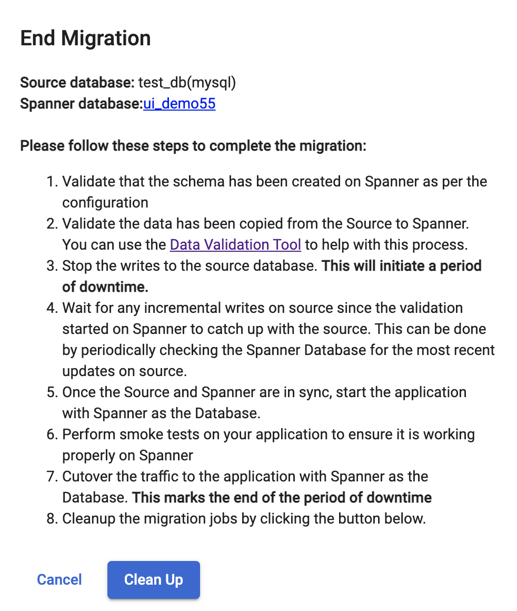

# End migration
{: .no_toc }

This is applicable only in case of minimal downtime migration. After a successful schema migration and initialization of dataflow and datastream jobs HarbourBridge presents the user with the steps to be followed to complete the migration. After completion of the migration process users can choose to clean up the migration jobs by clicking on the **Clean Up** button present on the UI.

  

    Table of contents
  

  {: .text-delta }
1. TOC
{:toc}

