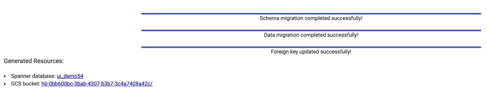

# Monitoring
{: .no_toc }

Spanner Migration Tool tracks the updates for schema migration, data migration and foreign key update. This information is polled from the backend at **5 sec** intervals and presented in the UI with separate progress bars. In case of an error during migration, the state of these progress bars is marked as canceled. After the successful completion of migration the generated resources are presented to the users for utilization.

{: .highlight }
In the context of minimal downtime migrations, monitoring is currently only limited to the initial job orchestration.

In case of minimal downtime migration with GoogleSQL dialect, the foreign keys are applied along with the schema migration.

  

    Table of contents
  

  {: .text-delta }
1. TOC
{:toc}

## Progress bars

## Generated resources

For the different types of migration following are the list of resources generated:

- **POC migration** - Link to spanner database created and the GCS bucket which has the [session file](#bookmark=id.4buhr2y7q8jw) written to it.
- **Minimal downtime migration** - Link to spanner database created, GCS bucket with [session file](#bookmark=id.4buhr2y7q8jw), datastream and dataflow job launched.
