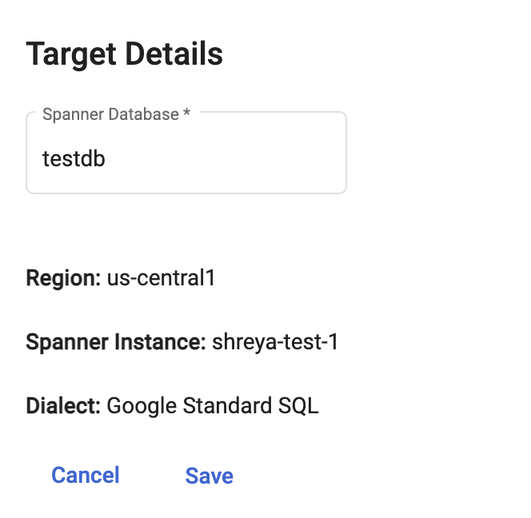

# Setting up target database details
{: .no_toc }

In order to create a spanner database and/or migrate data to it, the user needs to specify the target database name, it serves as the name of the spanner database that gets created (or gets wirtten to, depending on the migration mode).

{: .important }
Attempt to perform schema-and-data migrations to a database with a non-empty schema will fail.

  

    Table of contents
  

  {: .text-delta }
1. TOC
{:toc}

