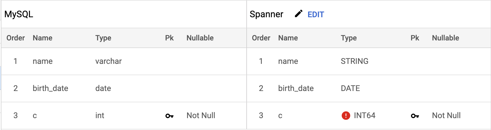
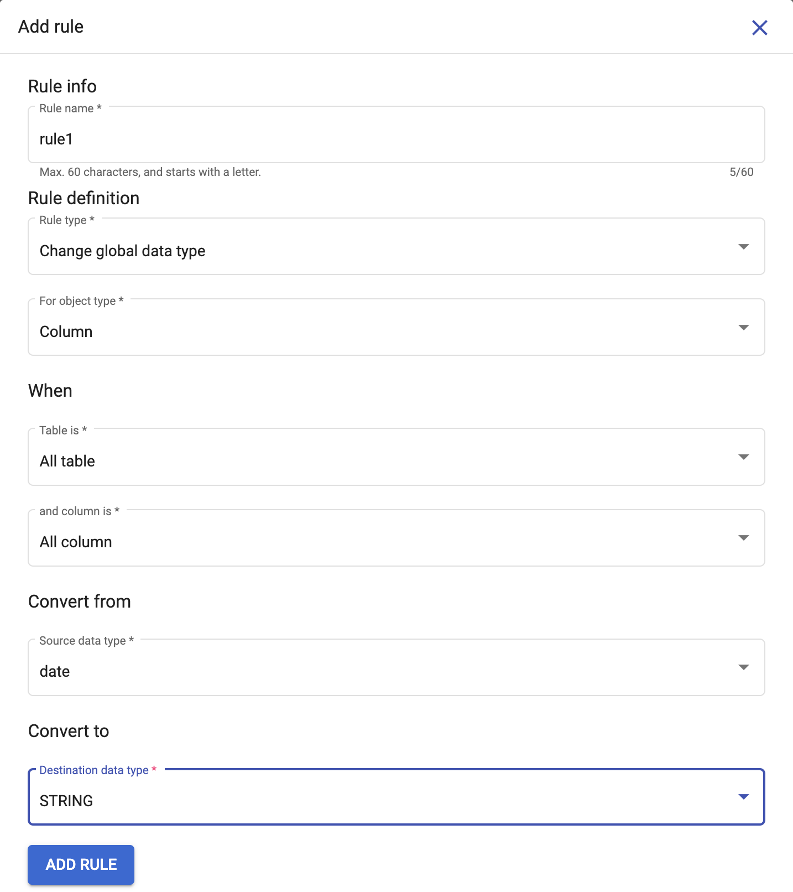
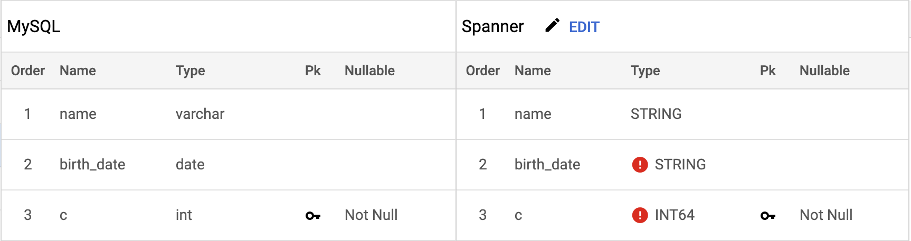

# Change Global Data type
{: .no_toc }

Spanner migration tool has a default mapping for all the data types of the supported databases. But it also provides the users with the flexibility to modify the data type mapping, if required. For changing the global data type the user needs to go to the **Rules tab** and click on **Add Rule**, an add rule form opens up wherein the user needs to select the rule type as **Change global data type** and specify the source data type for which they need to modify the mapping and the resulting spanner datatype they want it to be mapped to. After specifying all these details once a user clicks on **Add Rule**, the rule takes effect immediately and the spanner data type is modified based on the new data type mapping.

  

    Table of contents
  

  {: .text-delta }
1. TOC
{:toc}

