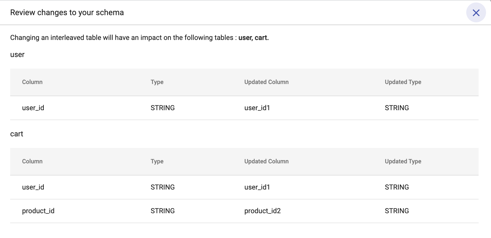

# Review Changes
{: .no_toc }

In cases where the user is modifying any column associated with an interleaved table, Spanner migration tool provides a review pane which shows how their changes would impact tables across the database. And once the user has verified these changes they can click on ‘Confirm Conversion’ and the changes would be applied to the database.

  

    Table of contents
  

  {: .text-delta }
1. TOC
{:toc}

