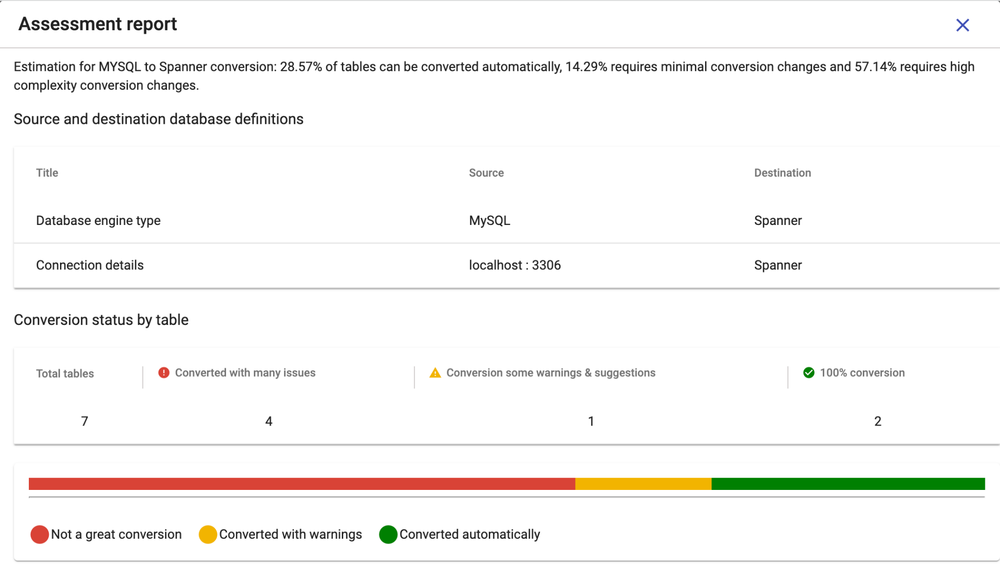

# View Assessment
{: .no_toc }

It provides the summary of schema conversion in terms of assessment report. Assessment report helps the user to understand the complexity of the schema conversion. It's broken down into 3 categories - automatic conversion, minimal complexity conversion and high complexity conversion. The conversion complexity is calculated based on the warnings and issues.

  

    Table of contents
  

  {: .text-delta }
1. TOC
{:toc}

