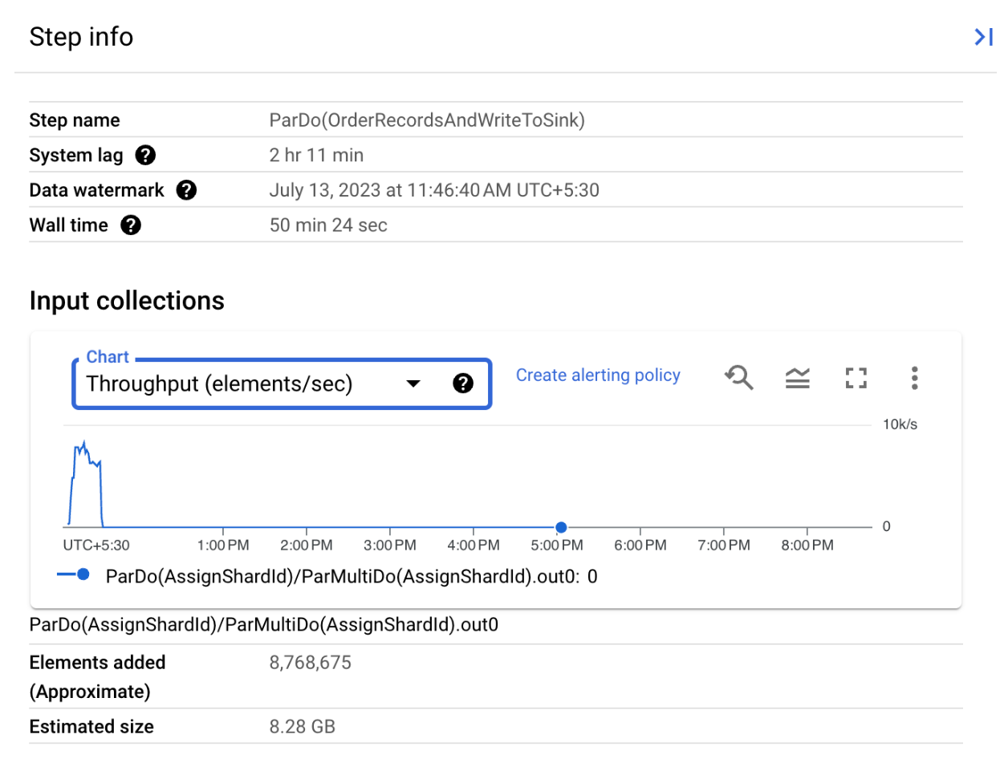
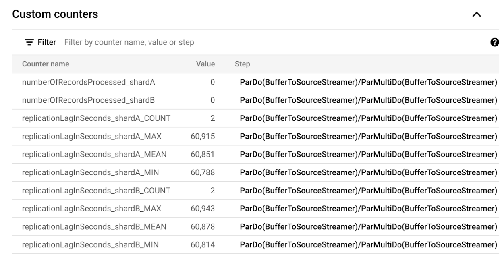
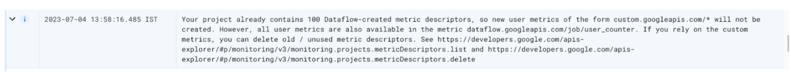
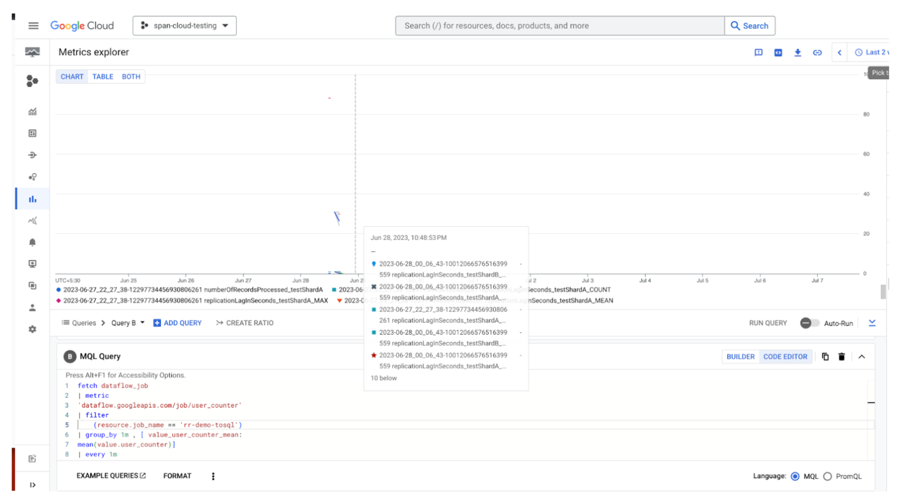

# Cloud Spanner Reverse Replication User Guide

## Overview

### Background

Migrating a database is a complex affair, involving changes to the schema, converting the application, tuning for performance, ensuring minimal downtime and completeness during data migration. It is possible that after migration and cutover, issues/inconsistent performance are encountered on the target (Cloud Spanner) requiring a fallback to the original source database with minimal disruption to the service. Reverse replication enables this fallback by replicating data written on Cloud Spanner back to the source database.This allows the application to point to the source and continue serving requests correctly.

Reverse replication could also be used to replicate the Cloud Spanner writes to a different database, other than the source database, for performing reconciliation, validations and reporting.

### How it works

Reverse replication flow involves below steps:

1. Reading the changes that happened on Cloud Spanner using [Cloud Spanner change streams](https://cloud.google.com/spanner/docs/change-streams)
2. Removing forward migrated changes
3. Cloud Spanner being distributed database, the changes captured must be temporally ordered before writing to a single source database
4. Transforming Cloud Spanner data to source database schema
5. Writing to source database

These steps are achieved by two Dataflow jobs, along with an interim buffer which holds the ordered changes.


*Note that the buffer used is the [Cloud Pub/Sub](https://cloud.google.com/pubsub/docs/overview). Kafka is experimentally supported and requires manual setup, which is not discussed in this guide. [Contact us](#contact-us) for using Kafka.*

## Before you begin

A few prerequisites must be considered before starting with reverse replication.

1. Make sure that there is network connectivity between source database and your GCP project on which the Dataflow jobs will run.Ensure the Dataflow worker IPs can access the MySQL IPs.
2. Ensure that Dataflow permissions are present.[Basic permissions](https://cloud.google.com/dataflow/docs/guides/templates/using-flex-templates#before_you_begin:~:text=Grant%20roles%20to%20your%20Compute%20Engine%20default%20service%20account.%20Run%20the%20following%20command%20once%20for%20each%20of%20the%20following%20IAM%20roles%3A%20roles/dataflow.admin%2C%20roles/dataflow.worker%2C%20roles/bigquery.dataEditor%2C%20roles/pubsub.editor%2C%20roles/storage.objectAdmin%2C%20and%20roles/artifactregistry.reader) and [Flex template permissions](https://cloud.google.com/dataflow/docs/guides/templates/configuring-flex-templates#permissions).
3. Ensure the compute engine service account has the following permissions:
    - roles/pubsub.subscriber
    - roles/pubsub.publisher
    - roles/spanner.databaseUser
4. Ensure the authenticated user launching reverse replication has the following permissions: (this is the user account authenticated for the Spanner Migration Tool and not the service account)
    - roles/spanner.databaseUser
    - roles/pubsub.editor
    - roles/dataflow.developer
5. Ensure that [golang](https://go.dev/dl/) (version 1.18 and above) is setup on the machine from which reverse replication flow will be launched.
6. Ensure that gcloud authentication is done,refer [here](https://github.com/cloudspannerecosystem/harbourbridge/tree/master#before-you-begin).
7. Ensure that the target Spanner instance ready.
8. Ensure that that [session file](https://github.com/cloudspannerecosystem/harbourbridge/tree/master#files-generated-by-harbourbridge) is uploaded to GCS (this requires a schema conversion to be done).
9. [Source shards file](https://docs.google.com/document/d/1GmUIH0MjaCa1WxNAows_HxRQ1ViLEdqpz9mTPmXlsLI/edit#heading=h.w6ufdjdzqwrp) already uploaded to GCS.
10. Resources needed for reverse replication incur cost. Make sure to read [cost](#cost).

## Launching reverse replication

Currently, the reverse replication flow is launched manually via a script. The details for the same are documented [here](https://github.com/GoogleCloudPlatform/spanner-migration-tool/tree/master/reverse_replication#reverse-replication-setup).

## Observe, tune and troubleshoot

### Tracking progress

The progress of the Dataflow jobs can be tracked via the Dataflow UI.

#### Metrics for Dataflow job that writes from Spanner to Sink

The last step gives an approximation of where the step is currently - the Data Watermark would give indication of Spanner commit timestamp that is guaranteed to be processed.



#### Metrics for Dataflow job that writes to source database

The Dataflow job that writes to source database exposes per shard metric like so:



These can be used to track the pipeline progress.
However, there is a limit of 100 on the total number of metrics per project. So if this limit is exhausted, the Dataflow job will give a message like so:



In such cases, the metrics can be viewed on the [Cloud Monitoring](https://cloud.google.com/monitoring/docs/monitoring-overview) console by writing a query:



Sample query

```code
fetch dataflow_job
| metric
'dataflow.googleapis.com/job/user_counter'
| filter
(resource.job_name == 'rr-demo-tosql')
| group_by 1m , [ value_user_counter_mean:
mean(value.user_counter)]
| every 1m
```

Metrics visible on Dataflow UI  can also be queried via REST,official document [here](https://cloud.google.com/dataflow/docs/reference/rest/v1b3/projects.locations.jobs/getMetrics?apix_params=%7B%22projectId%22%3A%22span-cloud-testing%22%2C%22location%22%3A%22us-east1%22%2C%22jobId%22%3A%222023-06-06_05_20_27-10999367971891038895%22%7D).

### Troubleshooting

The Dataflow logs are an excellent way to understand if something is not working as expected.

If you observe that the pipeline is not making expected progress, check the Dataflow logs for any errors.For Dataflow related errors, please refer [here](https://cloud.google.com/dataflow/docs/guides/troubleshooting-your-pipeline) for troubleshooting.

Apart from that,following are some scenarios and how to handle them.

- ***The watermark of the Spanner to Sink pipeline does not advance***

    This happens when the job is hit with a huge backlog, that leads to infinite loop. The recovery steps are covered [here](https://github.com/GoogleCloudPlatform/spanner-migration-tool/tree/master/reverse_replication#recovery-steps-for-the-infinte-loop).

- ***PubSub message count is not decreasing and the same data is being written back to source***

    This happens when the time to write all messages to source database and send an ACK to PubSub exceeds the deadline. Ensure the ACK deadline for the subscriptions are high enough (10 minutes is the highest value, consider bumping it to that). If still facing this issue, consider moving the Dataflow job writing to source database geographically closer to the source database.

- ***Some records are not reverse replicated***

    Records of below nature are dropped from reverse replication. Check the Dataflow logs to see if they are dropped.
    1. Records which are forward migrated. 
    2. Records for which primary key cannot be determined on the source database.This can happen when the source database table does not have a primary key, or the primary key value was not present in the change stream data, or the record was deleted on Cloud Spanner and the deleted record was removed from Cloud Spanner due to lapse of retention period by the time the record was to be reverse replicated.

- ***There is higher load than the expected QPS on  spanner instance post cutover***

     If the forward migration is still running post cutover, the incoming writes on Spanner that are reverse-replicated to the source get forward migrated again. This can cause the load on Spanner to be almost double the expected QPS, as each write will get reflected twice. Also, it could lead to transient inconsistencies in data under certain cases. To avoid this, stop/delete the forward migration pipeline post cutover. If the forward pipeline is required, add custom filtration rules and build a custom forward migration dataflow template.

### Retry

For both the Dataflow jobs, once an error is encountered for a given shard, then procesing is stopped for that shard to preserve ordering.To recover,rerun the job.The jobs are idempotent and it's safe to rerun them.

The command to run the Dataflow jobs should be available when launching the Dataflow jobs via launcher script.

Example command for the Spanner to Sink job

```code
gcloud dataflow flex-template run ordering-fromspanner \
  --project span-cloud-testing \
  --region us-east1 \
  --template-file-gcs-location gs://dataflow/templates/flex/Spanner_Change_Streams_to_Sink \
--additional-experiments=use_runner_v2 \
  --parameters "changeStreamName=allstream" \
  --parameters "instanceId=aks-east-inst" \
  --parameters "databaseId=demo" \
  --parameters "spannerProjectId=span-cloud-testing" \
  --parameters "metadataInstance=test-inst" \
  --parameters "metadataDatabase=cs-meta" \
  --parameters "sinkType=pubsub" \
  --parameters "pubSubDataTopicId=projects/span-cloud-testing/topics/rr-poc-topic" \
  --parameters "pubSubErrorTopicId=projects/span-cloud-testing/topics/rr-poc-topic" \
  --parameters "pubSubEndpoint=us-east1-pubsub.googleapis.com:443" \
--parameters "sessionFilePath=gs://path-to-session/demo-session.json"

```

Example command for the writing to source database job

```code
gcloud beta dataflow flex-template run writes-tosql  --project=span-cloud-testing     --region=us-east1     --template-file-gcs-location=gs://dataflow/templates/flex/Ordered_Changestream_Buffer_to_Sourcedb --num-workers=1  --worker-machine-type=n2-standard-64 --additional-experiments=use_runner_v2 --parameters sourceShardsFilePath=gs://path-to-source-shards/demo_cloud_shard.json,sessionFilePath=gs://path-to-session-file/demo-session.json,bufferType=pubsub,pubSubProjectId=span-cloud-testing

```

## Best practices

1. Avoid backlog build up of Spanner writes before starting the reverse replication. Start the reverse replication pipeline just before cutover of the first shard.

2. Set the chagne stream retention period to maximum value of 7 days to avoid any data loss.

3. Use the launcher script to create the necessary GCP resources and avoid creating them manually.


## Customize

The Dataflow jobs can be customized. 
Some use cases could be:
1. To customize the logic to filter records from reverse replication.
2. To handle some custom reverse transformation scenarios.
3. To customize shard level routing.

To customize, checkout the open source template, add the custom logic, build and launch the open source template.

Refer to [Spanner Change Streams to Sink template](https://github.com/GoogleCloudPlatform/DataflowTemplates/tree/main/v2/spanner-change-streams-to-sink#readme) on how to build and customize this. 

Refer to [Ordered Changestream Buffer to Sourcedb](https://github.com/GoogleCloudPlatform/DataflowTemplates/tree/main/v2/ordered-changestream-buffer-to-sourcedb#readme) on how to build and customize this.

## Limitations

Limiations are covered [here](https://github.com/GoogleCloudPlatform/spanner-migration-tool/tree/master/reverse_replication#reverse-replication-limitations).

## Cost

1. Cloud Spanner change stream incur additional storage requirement, refer [here](https://cloud.google.com/spanner/docs/change-streams#data-retention).
2. For Dataflow pricing, refer [here](https://cloud.google.com/dataflow/pricing)
3. For Pub/Sub pricing, refer [here](https://cloud.google.com/pubsub/pricing).

## Contact us

Have a question? We are [here](https://cloud.google.com/support).
